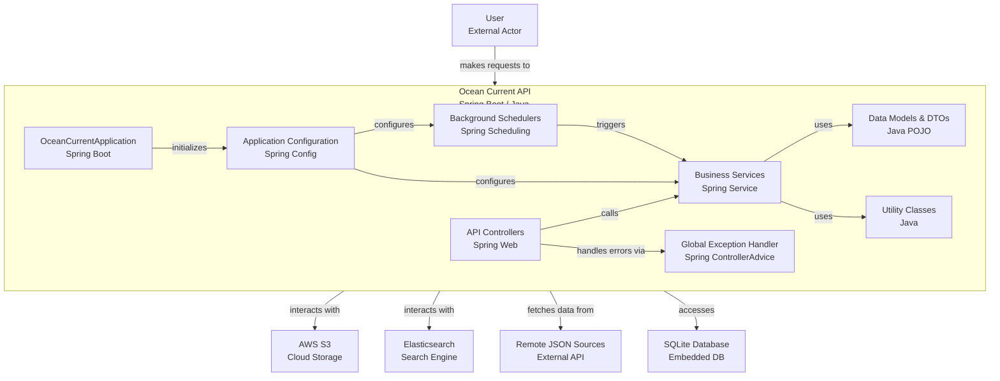

# Ocean-Current

## Prerequisites

> JDK 17

## Version Info

> Spring Boot 3.3.4
>
> Gradle 8.10+

## Development

### Environment Variables

- expose to VM or set in IDEA

```shell
elasticsearch.host="your elasticsearch host"
elasticsearch.apiKey="your elasticsearch api key"
elasticsearch.maxResultWindow=20000
remote.json.baseURL="the remote json file server URL"
sqlite.remote-url="the sqlite db file URL"
aws.region="your aws region"
aws.s3.bucket-name="the-bucket-name"
aws.access-key-id="aws-access-key-id"
aws.secret-access-key="aws-secret-access-key"
```

- Or create a .env file in the root directory of the project.

```text
ES_HOST="your elasticsearch host"
ES_API_KEY="your elasticsearch api key"
ES_MAX_RESULT_WINDOW=20000
REMOTE_JSON_BASE_URL="the remote json file server URL"
SQLITE_REMOTE_URL="the sqlite db file URL"
AWS_REGION="your aws region"
AWS_S3_BUCKET_NAME="the-bucket-name"
AWS_ACCESS_KEY_ID="aws-access-key-id"
AWS_SECRET_ACCESS_KEY="aws-secret-access-key"
```

### Run

- By IDEA(IntelliJ, same below)

  Gradle -> Tasks -> application -> bootRun

- By CLI

  ```shell
  ./gradlew bootRun
  ```

### Test

- By IDEA

  Gradle -> Tasks -> verification -> test

- By CLI

  ```shell
  ./gradlew test
  ```

### Build

- By IDEA

  Gradle -> Tasks -> build -> clean

  Gradle -> Tasks -> build -> build

- By CLI

  ```shell
  ./gradlew clean build
  ```

## Documentation

For detailed documentation, see the `docs/` directory:

- **[SQLite Integration](docs/SQLITE_INTEGRATION.md)** - Complete guide to the SQLite wave tags integration, including API endpoints, configuration, and usage examples
- **[Product Tag Architecture](docs/PRODUCT_TAG_ARCHITECTURE.md)** - Technical architecture documentation for the extensible product tag service system


## Simple Architecture Diagram ( at 04/07/2025 )


